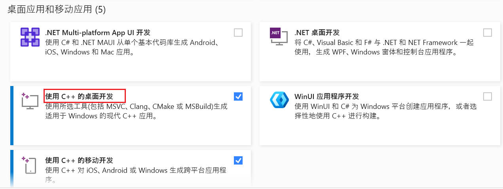

# 课程流程

## 0. 环境准备

| 序号 | 内容                    | 说明                                                         | 下载地址                                               |
| :--- | :---------------------- | :----------------------------------------------------------- | :----------------------------------------------------- |
| 1    | VisualStudio 2022       | Windows平台后端C++开发编译器，如果选择MAC平台开发，则不用这个，选择第二项的Clion | https://visualstudio.microsoft.com/zh-hans/vs/         |
| 2    | Clion                   | Mac平台后端C++开发编译器，如果选择Windows平台开发，则不用这个，选择第一项的VS2022 | https://www.jetbrains.com/clion/                       |
| 3    | VSCode/WebStorm         | 前端开发IDE，二选一即可，个人推荐VSCode，比较轻量            | https://code.visualstudio.com/                         |
| 4    | node.js                 | 前端开发所需要依赖node.js环境                                | https://nodejs.org/zh-cn                               |
| 5    | Wireshark               | 安装Wireshark，我们的抓包软件基于Wireshark才能工作，后续会集成Wireshark的部分组件，那个时候就可以在没有Wireshark的电脑上也能运行了 | https://www.wireshark.org/                             |
| 6    | ip2region               | 用于获取IP归属地的开源C++库                                  | 链接：https://pan.quark.cn/s/a4d7a4919eae 提取码：LswE |
| 7    | rapidjson               | 腾讯开源的高性能JSON处理C++库                                | 同上                                                   |
| 8    | rapidxml                | 优秀的开源XML处理C++库                                       | 同上                                                   |
| 9    | httplib                 | 超轻量的HTTP开源库                                           | 同上                                                   |
| 10   | loguru                  | 轻量级日志开源库                                             | 同上                                                   |
| 11   | sqlite3                 | sqlite3开源C++库，处理数据存储                               | 同上                                                   |
| 12   | 《C和指针（第二版）》   | C语言薄弱的小伙伴可以复习一下C语言，推荐看这本书             | 链接：https://pan.quark.cn/s/77d3a70966fb 提取码：9GrZ |
| 13   | 《C++ Primer（第5版）》 | C++基础差的小伙伴可以看一下这本书，把面向对象编程、标准库容器重点看一下，迭代器这些啥的了解即可 | 链接：https://pan.quark.cn/s/b00d6c10c385 提取码：wpJn |
| 14   | 《React快速入门教程》   | 快速入门React，推荐大家看一下B站教程                         | https://www.bilibili.com/video/BV1wy4y1D7JT            |

将开源库复制到 `include` 文件夹下： `D:\Visual Studio2022\VC\Tools\MSVC\14.43.34808\include`

## C++ 基础


## 第 1 课 Wireshark与 Tshark使用指南

> [内容讲解](https://articles.zsxq.com/id_4rjqwb3pd31n.html)

### 内容

#### 启用 Wireshark

**Wireshark主要特点：**

- 支持三千多种协议深度解析
- 实时捕获和离线分析
- 强大的过滤功能 （Display Filter、Capture Filter）
- 支持流分析（FollowStream）
- 支持多种操作系统（Windows、Linux、macOS）

**[安装 Wireshark](https://www.wireshark.org/)**：在Windows上，安装时通常需要选择安装 WinPcap 或 Npcap 以支持网络抓包。

- **Open**：对应离线分析数据包文件；

- **Capture**：实时采集网卡数据包；

- Wireshark 用一个流量趋势图表示真正意义上的物理网卡，其余流量未波动的都是一些虚拟设备。其中 Loopback 为本地回环虚拟网卡；

- [过滤语法-filter](https://www.wireshark.org/docs/man-pages/wireshark-filter.html)

#### 启用 tshark

[tshark 文档](https://www.wireshark.org/docs/man-pages/tshark.html)

tshark 是Wireshark的命令行版本，可以在终端中执行抓包和数据分析操作，适用于自动化任务和服务器环境。这个程序和 Wireshark位于同一个目录下。

```cmd
# 枚举系统的网卡
tshark -D
# 指定抓包网卡数字4并保存到 capture.pcap
tshark -i 4 -w capture.pcap
# Y指定过滤表达式
tshark -i 4 -Y "http" -w capture.pcap
# 解析离线capture.pcap
tshark -r capture.pcap
```

### 作业

> [第一课作业参考](https://t.zsxq.com/W83KM)

#### 抓取微信登陆 

方法 1

注意可能未 IPv6 地址形式，如 `2409:8c20:818:118::4 `；

```cmd
# 使用ping 获取ip
ping weixin.qq.com
# 使用 ip.addr == 43.129.254.124 进行抓包
```

方法 2（推荐）

```cmd
# 打开任务管理器，获取微信进程 PID；
# 使用 netstat -ano|findstr 21936，获取微信进程网络连接地址
netstat -ano|findstr 21936
# 若不反应，使用netstat -ano 查看所有条目
netstat -ano
# 使用 ip.addr == ×.×.× 进行过滤
ipv6.addr == 2409:8c54:1050:ff::d
# 本机
ipv6.addr == 2001:250:fe01:130:a8c0:25c2:7d05:1398
```

**远程端口 `443`：https 协议默认端口**

#### tshark 练习

```cmd
# 枚举系统的网络接口
tshark -D
# 选择合适的网卡并抓取1000个数据包
# 文件默认保存位置为：C:\Users\Wanggs
tshark -i 4 -c 200 -w capture.pcap
# 解析capture.pcap，筛选出所有TCP协议的数据包
tshark -r capture.pcap -Y "tcp"
# 统计capture.pcap中各个协议的数据包流量
# 读取离线文件，-q安静模式，-z启用统计功能
# io输入输出流量，phs(Protocol Hierarchy Statistics)协议层次统计
tshark -z help
tshark -r capture.pcap -q -z io,phs
```


## 第 2 课 使用 tshark 分析离线 pcap 文件

> [内容讲解](https://articles.zsxq.com/id_kvpzkl2s5xp8.html)

### 内容

#### Visual Studio 2022

注意安装时勾选 `C++桌面` 方便后续存在 `C++` 控制台模块，注意**多勾选会额外占用空间**，用哪个就选择哪个即可。



**Visual Studio 2022 卸载后面两项不能改盘问题解决办法**

1. `wint+R`，输入 `regedit`

2. 找到计算机 `\HKEY_LOCAL_MACHINE\SOFTWARE\Microsoft\VisualStudio\Setup`

3. 右键 `CachePath` 和 `SharedInstallationPath`，把这两个删除掉

#### rawshark 创建步骤

项目名：`rawshark`

**1.通过管道读取 tsahrk 输出的内容**

进程间通信（Inter-Process Communication, IPC）：指**不同进程之间交换数据**的机制。在 OS 中，常见的 IPC 方式包括：

- **管道（pipes）**：单项数据流通道，父子进程可使用；
- **套接字（Sockets）** ：用于本地或网络通信；
- 命名管道（FIFO） ：支持不同进程间通信的管道；

- 共享内存（SharedMemory） ：多个进程共享同一段内存，速度快但需要同步控制；

- 消息队列（MessageQueues） ：用于发送和接收数据块；

本项目使用**管道**让 tshark 的输出直接传递到 C/C++ 程序进行解析。借助 `popen` 函数（`C` 语言标准库提供的函数），创建一个管道并启用一个子进程，在**父进程和子进程之间建立通信通道**。


