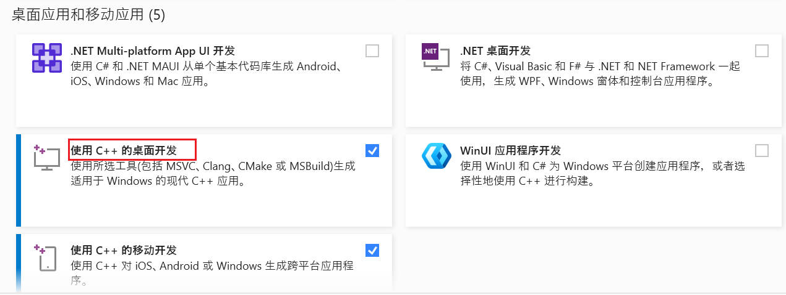
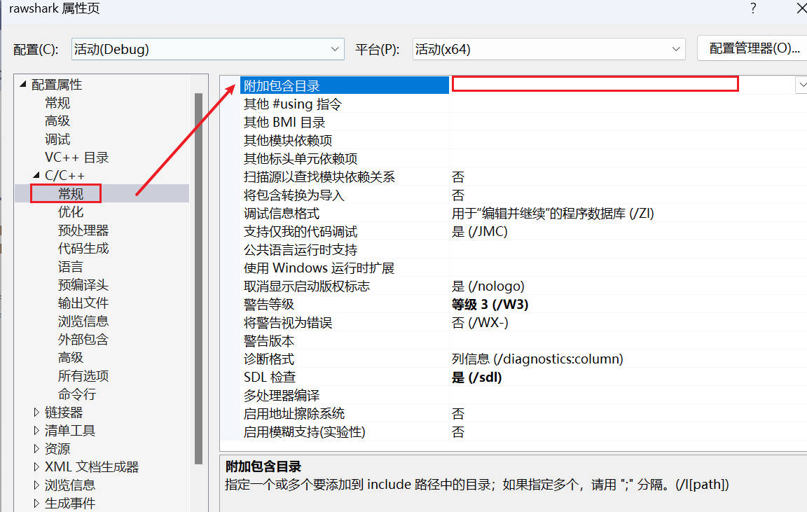
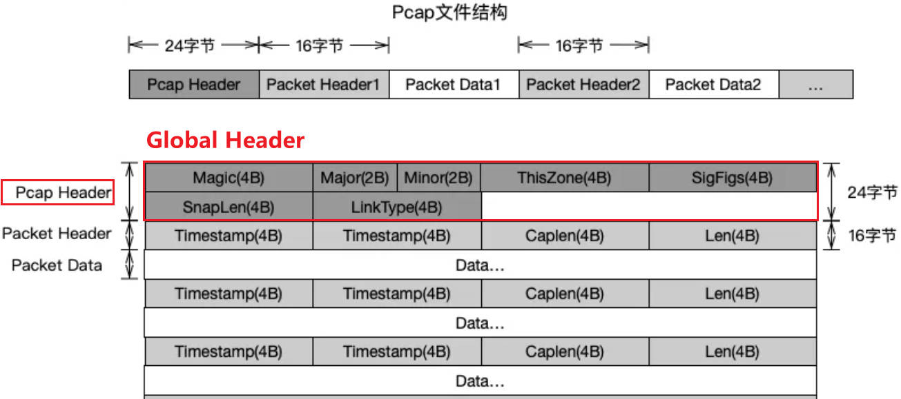
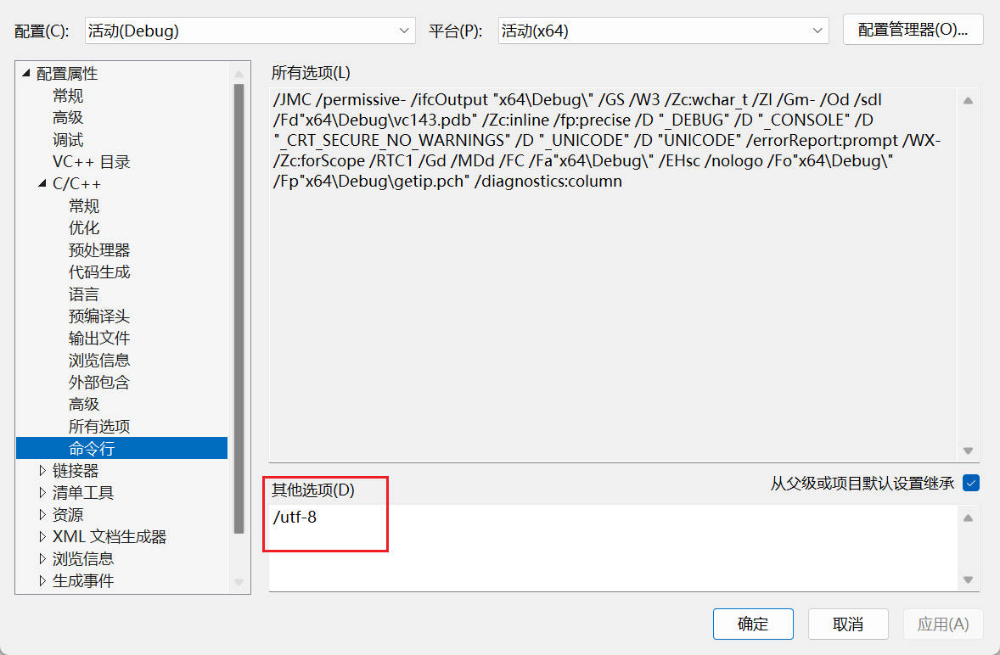
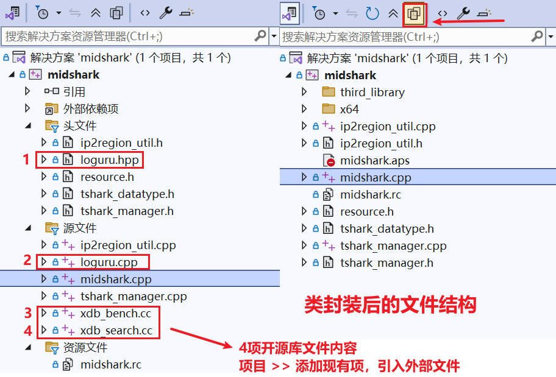
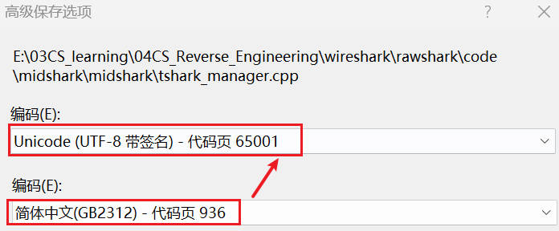

# 课程流程

## 0. 环境准备

| 序号 | 内容                    | 说明                                                         | 下载地址                                               |
| :--- | :---------------------- | :----------------------------------------------------------- | :----------------------------------------------------- |
| 1    | VisualStudio 2022       | Windows平台后端C++开发编译器，如果选择MAC平台开发，则不用这个，选择第二项的Clion | https://visualstudio.microsoft.com/zh-hans/vs/         |
| 2    | Clion                   | Mac平台后端C++开发编译器，如果选择Windows平台开发，则不用这个，选择第一项的VS2022 | https://www.jetbrains.com/clion/                       |
| 3    | VSCode/WebStorm         | 前端开发IDE，二选一即可，个人推荐VSCode，比较轻量            | https://code.visualstudio.com/                         |
| 4    | node.js                 | 前端开发所需要依赖node.js环境                                | https://nodejs.org/zh-cn                               |
| 5    | Wireshark               | 安装Wireshark，我们的抓包软件基于Wireshark才能工作，后续会集成Wireshark的部分组件，那个时候就可以在没有Wireshark的电脑上也能运行了 | https://www.wireshark.org/                             |
| 6    | ip2region               | 用于获取IP归属地的开源C++库                                  | 链接：https://pan.quark.cn/s/a4d7a4919eae 提取码：LswE |
| 7    | rapidjson               | 腾讯开源的高性能JSON处理C++库                                | 同上                                                   |
| 8    | rapidxml                | 优秀的开源XML处理C++库                                       | 同上                                                   |
| 9    | httplib                 | 超轻量的HTTP开源库                                           | 同上                                                   |
| 10   | loguru                  | 轻量级日志开源库                                             | 同上                                                   |
| 11   | sqlite3                 | sqlite3开源C++库，处理数据存储                               | 同上                                                   |
| 12   | 《C和指针（第二版）》   | C语言薄弱的小伙伴可以复习一下C语言，推荐看这本书             | 链接：https://pan.quark.cn/s/77d3a70966fb 提取码：9GrZ |
| 13   | 《C++ Primer（第5版）》 | C++基础差的小伙伴可以看一下这本书，把面向对象编程、标准库容器重点看一下，迭代器这些啥的了解即可 | 链接：https://pan.quark.cn/s/b00d6c10c385 提取码：wpJn |
| 14   | 《React快速入门教程》   | 快速入门React，推荐大家看一下B站教程                         | https://www.bilibili.com/video/BV1wy4y1D7JT            |

将开源库复制到 `include` 文件夹下： `D:\Visual Studio2022\VC\Tools\MSVC\14.43.34808\include`

### C++ 基础

- `main` 函数的返回类型必须是 `int`；

- 注意语句末位以分号结尾；
- `iostream` 库包含两个基础类型 `istream` 和 `ostream`；
- 标识符（identifier） 由字母，数字，下划线组成，对大小写敏感；
- 类一般定义在头文件中，且头文件名和类的名字一样；

```c++
//1.定义在std命名空间中，避免名字定义冲突
//作用域运算符::
std::cin >> v1 >> v2;
//等价于
std:cin >> v1;
std:cin >> v2;

//通过声明，直接使用标准库中的名字
#include <iostream>
using std:cin;
using std:cout;
using std:endl;

//2.单行和多行注释
/*
*多行注释
*/

//3.类
//点运算符.,调用运算符()
Student.name()
    
//4.类型修饰符（*，&）指针和引用
int *p1 = nullptr;
void* //存放任意类型对象的地址
    
//5.类型别名
typedef double wages; //传统方法
using SI = Sales_item;//新规定
```

#### 数据类型

```cpp
#include <stdint.h> // 标准整数类型定义
```

#### 常用函数解读

- `std::stoi`： 是 C++ 标准库中的一个函数，用于**将 `std::string` 类型的字符串转换为 `int` 类型**的整数。它定义在 `<string>`  头文件中；

- `c_str()`：`command.c_str()` 将 `command` 对象**（一个 `std::string` 类型的字符串）转换为 `C` 风格的字符串（ `const char*` 类型）**;

  ```cpp
  //1.std::stoi
  
  //2.c_str()
  std::string command = tshark_loc + " -r " + pcap_file + " " + fields;
  FILE* pipe = _popen(command.c_str(), "r");
  ```

#### 指针

智能指针 `shared_ptr`，`C++11` 引入。避免使用 C 语言中的原生指针，可减少因为指针使用不当导致的 bug。

#### 避免头文件重复包含

以 `tshark_manager.h` 头文件为例，其中 `#ifndef TSHARKMANAGER_H` 和 `#define TSHARKMANAGER_H` 是 C/C++ 中常用的 **Include Guards（包含保护）**，用于防止**头文件被重复包含**。

`#ifndef`、`#define` 和 `#endif` 的作用是确保头文件的内容只被编译一次，避免重复包含问题。

- 当第一次包含 `TSharkManager.h` 时，`TSHARKMANAGER_H` 未定义，因此会执行 `#define TSHARKMANAGER_H` 并编译头文件内容。
- 如果再次包含 `TSharkManager.h`，`TSHARKMANAGER_H` 已经定义，因此 `#ifndef` 条件为假，跳过整个头文件内容，避免重复编译。

```cpp
#ifndef TSHARKMANAGER_H
#define TSHARKMANAGER_H

#include "tshark_datatype.h"
#include "rapidjson/stringbuffer.h"
#include "ip2region_util.h"
#include <cstdio>
#include <cstdlib>
#include <cstring>
#include <set>
#include <unordered_map>
class TsharkManager {
public:
    TsharkManager(std::string workDir);
    ~TsharkManager();
    bool analysisFile(std::string filePath);
private:
    bool parseLine(std::string line, std::shared_ptr<Packet> packet); 
private:
    std::unordered_map<uint32_t, std::shared_ptr<Packet>> allPackets;
};

#endif //TSHARKMANAGER_H
```


### Visual Studio 2022

注意安装时勾选 `C++桌面` 方便后续存在 `C++` 控制台模块，注意**多勾选会额外占用空间**，用哪个就选择哪个即可。



**Visual Studio 2022 卸载后面两项不能改盘问题解决办法**

1. `wint+R`，输入 `regedit`

2. 找到计算机 `\HKEY_LOCAL_MACHINE\SOFTWARE\Microsoft\VisualStudio\Setup`

3. 右键 `CachePath` 和 `SharedInstallationPath`，把这两个删除掉

#### 快捷方式

工具 >> 选项 >> 字体和颜色，设置字体为 `Consolas`。

`ctrl+k,ctrl+f`：自动格式化；

`ctrl+e,ctrl+w`：自动换行；

#### 外部包的引入

**方法1：**将开源库复制到 `include` 文件夹下 `D:\Visual Studio2022\VC\Tools\MSVC\14.43.34808\include`

**方法2：**在 VS2022 中设置一下附加路径，使得 `include` 指令可以找到对应的文件。项目 >> 属性



#### 开源包的用法

**项目 >> 添加类：**

- 生成 `.h` 文件和 `.cpp` 文件；
- `.h` 文件用于类的定义，`.cpp` 文件用于类的实现；

**项目菜单 >> 添加 >> 现有项 >> 开源库对应的位置：**

- `ip2region` 中 `xdb_search.cc` 和 `xdb_bench.cc`  文件；
- `loguru`中 `loguru.cpp` 和 `loguru.hpp` 文件；

#### 设置文件打开页面

选择合适的页面布局方式即可（带三角符号）


## 常见问题答疑

> [语雀答疑](https://www.yuque.com/xuanyuanzhifeng-xofk5/hl8fig/qsnbpstok0gwq2un)


## 1. Wireshark与 Tshark使用指南

> [内容讲解](https://articles.zsxq.com/id_4rjqwb3pd31n.html)

### 内容

#### 启用 Wireshark

**Wireshark主要特点：**

- 支持三千多种协议深度解析
- 实时捕获和离线分析
- 强大的过滤功能 （Display Filter、Capture Filter）
- 支持流分析（FollowStream）
- 支持多种操作系统（Windows、Linux、macOS）

**[安装 Wireshark](https://www.wireshark.org/)**：在Windows上，安装时通常需要选择安装 WinPcap 或 Npcap 以支持网络抓包。

- **Open**：对应离线分析数据包文件；

- **Capture**：实时采集网卡数据包；

- Wireshark 用一个流量趋势图表示真正意义上的物理网卡，其余流量未波动的都是一些虚拟设备。其中 Loopback 为本地回环虚拟网卡；

- [过滤语法-filter](https://www.wireshark.org/docs/man-pages/wireshark-filter.html)

#### 启用 tshark

[tshark 文档](https://www.wireshark.org/docs/man-pages/tshark.html)

tshark 是Wireshark的命令行版本，可以在终端中执行抓包和数据分析操作，适用于自动化任务和服务器环境。这个程序和 Wireshark位于同一个目录下。

```cmd
# 枚举系统的网卡
tshark -D
# 指定抓包网卡数字4并保存到 capture.pcap
tshark -i 4 -w capture.pcap
# Y指定过滤表达式
tshark -i 4 -Y "http" -w capture.pcap
# 解析离线capture.pcap
tshark -r capture.pcap
```


### 作业

> [第一课作业参考](https://t.zsxq.com/W83KM)

#### 抓取微信登陆 

方法 1

注意可能未 IPv6 地址形式，如 `2409:8c20:818:118::4 `；

```cmd
# 使用ping 获取ip
ping weixin.qq.com
# 使用 ip.addr == 43.129.254.124 进行抓包
```

方法 2（推荐）

```cmd
# 打开任务管理器，获取微信进程 PID；
# 使用 netstat -ano|findstr 21936，获取微信进程网络连接地址
netstat -ano|findstr 21936
# 若不反应，使用netstat -ano 查看所有条目
netstat -ano
# 使用 ip.addr == ×.×.× 进行过滤
ipv6.addr == 2409:8c54:1050:ff::d
# 本机
ipv6.addr == 2001:250:fe01:130:a8c0:25c2:7d05:1398
```

**远程端口 `443`：https 协议默认端口**

#### tshark 练习

```cmd
# 枚举系统的网络接口
tshark -D
# 选择合适的网卡并抓取1000个数据包
# 文件默认保存位置为：C:\Users\Wanggs
tshark -i 4 -c 50 -w capture.pcap
# 解析capture.pcap，筛选出所有TCP协议的数据包
tshark -r capture.pcap -Y "tcp"
# 统计capture.pcap中各个协议的数据包流量
# 读取离线文件，-q安静模式，-z启用统计功能
# io输入输出流量，phs(Protocol Hierarchy Statistics)协议层次统计
tshark -z help
tshark -r capture.pcap -q -z io,phs
```


## 2. 使用 tshark 分析离线 pcap 文件

> [内容讲解](https://articles.zsxq.com/id_kvpzkl2s5xp8.html)

### 内容

#### rawshark 创建步骤

项目名：`rawshark`

**通过管道读取 tsahrk 输出的内容**

进程间通信（Inter-Process Communication, IPC）：指**不同进程之间交换数据**的机制。在 OS 中，常见的 IPC 方式包括：

- **管道（pipes）**：单项数据流通道，父子进程可使用；
- **套接字（Sockets）** ：用于本地或网络通信；
- 命名管道（FIFO） ：支持不同进程间通信的管道；

- 共享内存（SharedMemory） ：多个进程共享同一段内存，速度快但需要同步控制；

- 消息队列（MessageQueues） ：用于发送和接收数据块；

本项目使用**管道**让 tshark 的输出直接传递到 C/C++ 程序进行解析。借助 `popen` 函数（`C` 语言标准库提供的函数），创建一个管道并启用一个子进程，在**父进程和子进程之间建立通信通道**。


### 作业

> [第二课作业参考](https://t.zsxq.com/TXlaO)

#### 注意点

`tshark` 提取的字段数明确，特别是从示例 6 字段变化为 8 字段，需增设 `-e tcp.srcport`，`-e tcp.dstport`

```cpp
const char* command = "E:/Wireshark4.2.6/Wireshark/tshark -r C:/Users/Wanggs/demo.pcap -T fields -e frame.number -e frame.time -e ip.src -e tcp.srcport -e ip.dst -e tcp.dstport -e _ws.col.Protocol -e _ws.col.Info";
```

**C++ 字符串变化 c_str(): std::string >> const char* **

```cpp
//command.c_str()将command对象（一个std::string类型的字符串）转换为C风格的字符串（const char* 类型）
FILE* pipe = _popen(command.c_str(), "r");
```

**为什么有些行IP地址是空的呢？**

1、在 `tshark` 中，`-e ip.src -e ip.dst` 参数输出的是 IPv4 的源 IP 和目的 IP，而如果遇到的是一个 IPv6 的数据报文，tshark 输出的就会变成空了。想要解决这个问题，需同时指定`-e ip.src -e ipv6.src -e ip.dst ipv6.dst`。然后在解析的时候，两个字段都要解析，哪个不为空，就取哪个作为数据包的源地址。

2、有些数据包本身就没有网络层的，比如 `ARP`，当然也就没有IP地址了。

**改进后的 `tshark` 参数指令**

```cmd
std::string command = "/Applications/Wireshark.app/Contents/MacOS/tshark -r " + packet_file + " -T fields -e frame.number -e frame.time -e ip.src -e ipv6.src -e ip.dst -e ipv6.dst -e tcp.srcport -e udp.srcport -e tcp.dstport -e udp.dstport -e _ws.col.Protocol -e _ws.col.Info";
```

#### 主程序

```cpp
// rawsahrk.cpp : 此文件包含 "main" 函数。程序执行将在此处开始并结束。
//注意将开源库复制到 `include` 文件夹下： `D:\Visual Studio2022\VC\Tools\MSVC\14.43.34808\include`
#include <iostream>
#include <cstdio>
#include <vector>
#include <string>
#include <sstream>
#include <format>
#include <windows.h>
#include "rapidjson/document.h"
#include "rapidjson/writer.h"
#include "rapidjson/stringbuffer.h"
#include "rapidjson/prettywriter.h"

//定义数据包结构体
struct Packet {
    int frame_number = -1;   //数据包编号
    std::string time;   //数据包时间戳
    std::string src_ip; //源IP地址
    int src_port = -1;
    std::string dst_ip; //目的IP
    int dst_port = -1;
    std::string protocol;   //协议
    std::string info;   //数据包概要信息
};

//字符串转数字
int port2Int(std::string port);

//编写解析函数，针对输出的每一行，解析为一个 packet 结构体
void parseLine(std::string line, Packet& packet);

//将Packet对象转换为JSON打印输出
void toJson(const Packet& packet);

//将Packet结构体转换为字符串
void toString(Packet& packet);

int main()
{
    //设置控制台输出编码
    SetConsoleOutputCP(CP_UTF8);
    //创建管道，r-从子进程读取数据
	//注意tshark提取的字段数，>=8，否则输出空字段
    const char* command = "E:/Wireshark4.2.6/Wireshark/tshark -r C:/Users/Wanggs/demo.pcap -T fields -e frame.number -e frame.time -e ip.src -e tcp.srcport -e ip.dst -e tcp.dstport -e _ws.col.Protocol -e _ws.col.Info";
    FILE* pipe = _popen(command, "r");
    if (!pipe) {
        std::cerr << "tshark failed" << std::endl;
        return 1;
    }
    
	std::vector<Packet> packets;
    char buffer[1024];
    
    //fgets标准库函数，定义在stdio.h中，从文件流中读取一行文本数据
    while (fgets(buffer, sizeof(buffer), pipe) != nullptr) {
        //std::cout << buffer;
		Packet packet;
		parseLine(buffer, packet);
		packets.push_back(packet);
    }

	// C++11引入的新式for循环，通过auto关键子自动推断类型
    for (auto& p : packets) {
        toString(p);
    }

    //std::wcout << L"Json如下：===================================\t" << std::endl;
    std::cout << reinterpret_cast<const char*>(u8"Json如下：\t") << std::endl;
   
    //转化为json
    for (auto& p : packets) {
        toJson(p);
    }
     
    //关闭管道，获取子进程的退出状态
    _pclose(pipe);

    std::cout << reinterpret_cast<const char*>(u8"src_ip或dst_ip为空的数据包：\t") << std::endl;

	//打印dst_ip和src_ip为空的数据包
    for (auto& p : packets) {
		if (p.dst_ip.empty() || p.src_ip.empty()) {
			toString(p);
		}
    }

    return 0;
}

//字符串转数字
int port2Int(std::string port) {
    try {
        return std::stoi(port);
    }
	catch (std::exception& e) {
		return -1;
	}
}


//将tshark输出解析成packet结构体
void parseLine(std::string line, Packet& packet) {
    //将行末尾的换行符去掉
    if (line.back() == '\n') {
        line.pop_back();
    }
    //stringstream是C++标准库中的一个类，允许把字符串当作输入输出流来处理
    std::stringstream ss(line);
    std::string field;
    std::vector<std::string> fields;

    // getline是C++提供的函数，用于从输入流中读取一行数据
    while (std::getline(ss, field, '\t')) {
        fields.push_back(field);
    }

    // 拆分字段保存到vector容器中，最后按照顺序赋值Packet 各个字段
    // 如果<8，则会输出空的字段
    if (fields.size() >=8) {
        packet.frame_number = port2Int(fields[0]);
        packet.time = fields[1];
        packet.src_ip = fields[2];
		packet.src_port = port2Int(fields[3]);
        packet.dst_ip = fields[4];
		packet.dst_port = port2Int(fields[5]);
        packet.protocol = fields[6];
        packet.info = fields[7];
    }

}

//将Packet结构体转换为字符串
void toString(Packet& packet) {
    std::string s = std::format(
        "frame_number:{0}\t time:{1}\t src_ip:{2}\t scr_port:{3}\t dst_ip:{4}\t dst_port:{5}\t protocol:{6}\t info:{7}",
        packet.frame_number,
        packet.time,
        packet.src_ip,
        packet.src_port,
        packet.dst_ip,
		packet.dst_port,
        packet.protocol,
        packet.info    
    );
    std::cout << s << std::endl;
}

//将Packet对象转换为JSON打印输出
void toJson(const Packet& packet) {
    //构建JSON对象
    rapidjson::Document pktObj;
    rapidjson::Document::AllocatorType& allocator = pktObj.GetAllocator();

    //设置JSON为Object对象类型
	pktObj.SetObject();

    //添加JSON字段
	pktObj.AddMember("frame_number", packet.frame_number, allocator);
	pktObj.AddMember("timestamp", rapidjson::Value(packet.time.c_str(), allocator), allocator);
	pktObj.AddMember("src_ip", rapidjson::Value(packet.src_ip.c_str(), allocator), allocator);
	pktObj.AddMember("src_port", packet.src_port, allocator);
	pktObj.AddMember("dst_ip", rapidjson::Value(packet.dst_ip.c_str(), allocator), allocator);
	pktObj.AddMember("dst_port", packet.dst_port, allocator);
	pktObj.AddMember("protocol", rapidjson::Value(packet.protocol.c_str(), allocator), allocator);
	pktObj.AddMember("info", rapidjson::Value(packet.info.c_str(
    ), allocator), allocator);
	
    //序列化为 JSON 字符串
	rapidjson::StringBuffer buffer;
	rapidjson::Writer<rapidjson::StringBuffer> writer(buffer);
	pktObj.Accept(writer);

    //打印JSON输出
	std::cout << buffer.GetString() << std::endl;
}
```


## 3. PCAP 文件格式

> [内容讲解](https://articles.zsxq.com/id_bl6ttgpfokv3.html)

### 内容

**获取数据包原始的十六进制数据：**

十六进制原始数据存放在原始 `pcap` 文件中，用 `Packet` 结构体中记录数据包的位置，到时候需要哪个数据包的十六进制数据，临时再去读就可以了。

#### PCAP 文件格式

`PCAP（Packet Capture）` 是一种广泛使用的文件格式，专门用于存储网络数据包。它由 `libpcap（Linux/macOS）`和 `WinPcap（Windows）` 库支持，通常用于网络分析工具，如 `Wireshark、tshark` 等。



**真实的网络数据包字节流，以十六进制形式存储**

```cpp
// PCAP Gloabal Header
struct PcapHeader {
    uint32_t magic_number;	// 标识文件格式，无符号32位整数,0xa1b2c3d4大端
    uint16_t version_major;	// PCAP文件版本号，一般为2.4
    uint16_t version_minor;
    int32_t thiszone;		// 时区偏移，一般为0，有符号32位整数
    uint32_t sigfigs;		// 时间戳精度，通常为0
    uint32_t snaplen;		// 捕获数据包最大长度，通常为65535
    uint32_t network;		// 链路层类型，0x01表示以太网
};

// PCAP Packet Header
struct PacketHeader {
    uint32_t ts_sec;	// 数据包捕获的时间戳(s)
    uint32_t ts_usec;	// 数据包捕获的时间戳(μs)微秒
    uint32_t caplen;	// 捕获的数据包长度
    uint32_t len;		// 数据包原始长度
};
```

#### 注意点

注意仅以 `.pcap` 后缀结尾的不一定是 `pcap` 格式。

一定要以 `-F pcap` 的方式保存或另存为 `pcap` 格式。

```cpp
tshark -i 4 -c 10 -F pcap -w demo1.pcap
```


### 作业

> [作业参考](https://t.zsxq.com/3xe5s)

```cmd
# 注意仅以.pcap后缀结尾的不一定是pcap格式
# 一定要以 -F pcap 的方式保存
tshark -i 4 -c 10 -F pcap -w demo1.pcap

bool readPacketHex(const std::string& filePath, uint32_t offset, uint32_t length, std::vector<unsigned char> &buffer) {
	std::ifstream file(filePath, std::ios::binary);
	if (!file) {
		std::cerr << "open file failed" << std::endl;
		return false;
	}

	file.seekg(offset, std::ios::beg);
	if (!file) {
		std::cerr << "seek file failed" << std::endl;
		return false;
	}

	buffer.resize(length);
    file.read(reinterpret_cast<char*>(buffer.data()), length);
	if (!file) {
		std::cerr << "read file failed" << std::endl;
		return false;
	}

	return true;
}
```


## 4. IP 属地查询

> [内容讲解](https://articles.zsxq.com/id_p0o2v83fjgs3.html)

### 内容

#### ip2region

目前行业里实现这个功能主要有两个方案：

1. 基于开源的数据库 [`ip2region`](https://github.com/lionsoul2014/ip2region)，并且提供了 `C++` 的开发接口，但是里面的数据有一些过时，有些IP的地理位置可能定位是错的；

2. 基于商业数据库，比如知名的有纯真数据库，并且纯真数据库也提供了可以免费使用的版本。

`ip2region`: 是一个离线IP地址定位库和IP定位数据管理框架，10微秒级别的查询效率，提供了众多主流编程语言的 `xdb` 数据生成和查询客户端实现。

**初始化**：`ip2region` 的工作依赖一个数据库文件 `ip2region.xdb`，包含所有 IP 地理位置数据。

#### 项目运行问题

**1.无法解析的外部符号**

将 `xdb_search.cc` 和 `xdb_bench.cc`  文件添加到 VS 项目中。项目菜单 >> 添加 >> 现有项 >> 找到两个文件所在的位置即可。

**2.解决 `fopen` 变 `fopen_s` **

**方法1（推荐）：**

```cpp
// xdb_bench.cc 文件更改
void xdb_bench_t::bench_test_file(const std::string& file_name) {
    FILE* f = nullptr;
    errno_t err = fopen_s(&f, file_name.data(), "r");
    if (err != 0 || f == nullptr) {
        log_exit("can't open " + file_name);
    }

    char buf[1024];
    while (fgets(buf, sizeof(buf), f) != nullptr) {
        bench_test_line(buf);
    }

    fclose(f); // 记得关闭文件
}

// xdb_search.cc 文件更改
xdb_search_t::xdb_search_t(const std::string& file_name) {
    db = nullptr;
    vector_index = nullptr;
    content = nullptr;

    // 使用 fopen_s 打开文件
    errno_t err = fopen_s(&db, file_name.data(), "rb");
    if (err != 0 || db == nullptr) {
        log_exit("can't open " + file_name);
    }
}
```

 **方法2：项目属性中未全局定义宏**

- 如果你在代码中定义了 `#define _CRT_SECURE_NO_WARNINGS`，但项目属性中未定义该宏，可能会导致某些文件仍然触发警告。
- 解决方法：
  1. 右键点击项目 -> 选择“属性”。
  2. 找到“C/C++” -> “预处理器”。
  3. 在“预处理器定义”中添加 `_CRT_SECURE_NO_WARNINGS`。
  4. 点击“应用”并重新编译。

```cpp
#define _CRT_SECURE_NO_WARNINGS
#include "ip2region_util.h"
#include <iostream>
```

**3.未声明的标识符问题**

**方法1：添加 `\utf-8` 即可（推荐）。**

方法2：将 `xdb_search.cc` 和 `xdb_bench.cc`  文件按照 `UTF-8 BOM` 格式进行保存。

方法3：删除两个文件中的中文注释。



**4.大量重定义**

将 `xdb_search.cc` 和 `xdb_bench.cc`  文件中 `winsock2.h` 头文件的包含改到 `windows.h` 的前面去。

```cpp
// xdb_search.cc
#include "xdb_search.h"
#ifdef _WIN32
#include <winsock2.h>
#include <ws2tcpip.h>
#include <windows.h>

// xdb_bench.cc
#include "xdb_bench.h"
#ifdef _WIN32
#include <winsock2.h>
#include <ws2tcpip.h>
#include <windows.h>
```

**5.缺乏网络库**

```cpp
// 在main函数所在的文件内添加
// 需要链接 ws2_32.lib 库
#ifdef _WIN32
#pragma comment(lib, "ws2_32.lib")
#endif
```


### 作业

> [作业参考](https://t.zsxq.com/fxnj4)

```cpp
// #include "ip2region_util.h"
#include "ip2region/xdb_search.h"
#include <string>
#include <memory>

class IP2RegionUtil {
public:
	static bool init(const std::string& xdbFilePath);
	static std::string getIpLocation(const std::string& ip);

private:
	static std::string parseLocation(const std::string& input);
	static std::shared_ptr<xdb_search_t> xdbPtr;
};
#pragma once
```

**增删说明**

```cpp
#include "ip2region_util.h"
// 以下ip2region_util.h 类的重新实现不需要前置声明
bool IP2RegionUtil::init(const std::string& xdbFilePath);
std::string IP2RegionUtil::getIpLocation(const std::string& ip);
std::string IP2RegionUtil::parseLocation(const std::string& input);


#include "rapidjson/writer.h"
#include "rapidjson/stringbuffer.h"
#include "rapidjson/prettywriter.h"
// void toJson(const Packet& packet); 中更改为PrettyWriter
//rapidjson::Writer<rapidjson::StringBuffer> writer(buffer);
rapidjson::PrettyWriter<rapidjson::StringBuffer> writer(buffer);   
```


## 5. 面向对象封装与轻量级 C++ 日志库 loguru

> [内容讲解](https://articles.zsxq.com/id_n6eeozgt6tw5.html)

### 内容

把 `tshark` 相关的操作都封装到一个类中，让我们的代码更加好维护。



**`TsharkManager.h` ：定义类及相关方法**

```cpp
// 部分程序
#ifndef TSHARKMANAGER_H
#define TSHARKMANAGER_H
#include <unordered_map>

class TsharkManager {
public:
    TsharkManager(std::string workDir);
    ~TsharkManager();
    // 分析数据包文件
    bool analysisFile(std::string filePath);
    // 打印所有数据包的信息
    void printAllPackets();
    // 获取指定编号数据包的十六进制数据
    bool getPacketHexData(uint32_t frameNumber, std::vector<unsigned char>& data);
private:
    // 解析每一行
    bool parseLine(std::string line, std::shared_ptr<Packet> packet);
private:
    std::string tsharkPath;
    // 当前分析的文件路径
    std::string currentFilePath;
    // 分析得到的所有数据包信息，key是数据包ID，value是数据包信息指针，方便根据编号获取指定数据包信息
    std::unordered_map<uint32_t, std::shared_ptr<Packet>> allPackets;
};
#endif //TSHARKMANAGER_H
```

**`TsharkManager.cpp` ：对类中方法的实现**

```cpp
#include "tshark_manager.h"
#include "third_library/loguru/loguru.hpp" // 使用LOG_F
```

**`ip2region.h` 对解析 IP 类的定义**

**`ip2region.cpp`：对类中方法的实现**

**`tshark_datatype.h`：定义结构体内容**

```cpp
// 部分程序
#ifndef TSHARK_DATATYPE_H
#define TSHARK_DATATYPE_H
#include <iostream>
#include <cstdio>
#include <cstdlib>
#include <cstring>
#include <vector>

// PCAP Packet Header
struct PacketHeader {
    uint32_t ts_sec;	// 数据包捕获的时间戳(s)
    uint32_t ts_usec;	// 数据包捕获的时间戳(μs)微秒
    uint32_t caplen;	// 捕获的数据包长度
    uint32_t len;		// 数据包原始长度
};
#endif // TSHARK_DATATYPE_H
```

**主程序**

```cpp
#include <iostream>
#include <windows.h>
#include "tshark_manager.h"
#ifdef _WIN32
#pragma comment(lib, "ws2_32.lib")
#endif

int main(int argc, char* argv[]) {
    //设置控制台输出编码
    SetConsoleOutputCP(CP_UTF8);
    TsharkManager tsharkManager("E:/03CS_learning/04CS_Reverse_Engineering/wireshark/rawshark/code/midshark/midshark");
    tsharkManager.analysisFile("C:/Users/Wanggs/demo1.pcap");
    tsharkManager.printAllPackets();

    return 0;
}
```

#### 类封装的注意点

**1.无法解析的外部符号**

将 `loguru.cpp` 和 `loguru.hpp`  文件添加到 VS 项目中。项目菜单 >> 添加 >> 现有项 >> 找到两个文件所在的位置即可。

**2.注意头文件的 `#ifndef` 的作用**

`#ifndef`、`#define` 和 `#endif` 的作用是确保头文件的内容只被编译一次，避免重复包含问题。

```cpp
#ifndef TSHARKMANAGER_H
#define TSHARKMANAGER_H

#include "tshark_datatype.h"
#include "rapidjson/stringbuffer.h"

class TsharkManager {
public:
private:
};
#endif //TSHARKMANAGER_H
```

#### 轻量级日志框架 `loguru`

一般使用 `cout` 或者 `printf` 打印一些错误信息，但有以下缺点：

- **日志管理不便** ：无法自动区分日志级别，不能方便地进行日志的筛选、存储或者格式化。
- **不支持多线程** ：在多线程环境下，直接使用可能会导致日志混乱，因为多个线程可能会同时写入日志。
- **缺乏时间戳和文件信息** ：输出日志不会自动附带时间戳、代码文件名、行号等信息，调试时不够直观。
- **性能问题** ：`std::cout`的性能较低，不能灵活控制日志的输出目的，比如同时写入文件和控制台。

**`loguru` 是一个轻量级的 C++ 日志库，支持以下功能：**

- 不同级别的日志 （INFO、WARNING、ERROR、FATAL等）

  info：表示普通信息日志，fatal：表示致命错误，会终止退出。

- 多线程日志安全

- 带有时间戳、文件名、函数名、行号的日志格式

- 自动写入日志文件

- 可以动态启用/禁用日志级别

- 支持颜色高亮输出

`loguru` 代码库就包含两个文件：`loguru.cpp` 和 `loguru.hpp`  。在 VS 中使用时不仅要 `include`，还要把它们添加到工程中来（项目 >> 添加现有项）。

#### 显示乱码问题的解决

[参考方法](https://blog.csdn.net/The_upset_grass/article/details/128383070)

将 VS2022 中的高级保存选项调出来，由默认保存的 GB2312 变为 UTF-8 格式，同时在 `main` 函数中设置控制台输出编码：`SetConsoleOutputCP(CP_UTF8)`。




### 作业

> [作业参考](https://t.zsxq.com/AWsQU)


